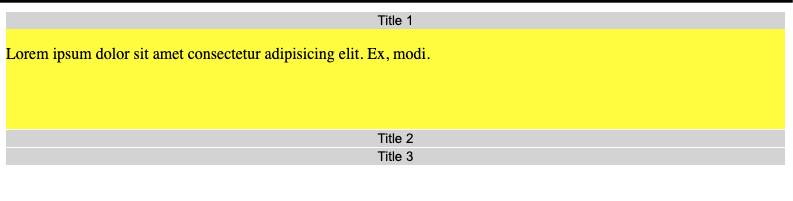

# Accordion 
### I learned so much while I was doing this even though it required just tiny bit of Javascript code. Here is the things that I learned:
---
1. when we pass the event from the HTML file to JS, it should be exactly `event`, not like `e` or `evt`. 

2. JS does NOT know `id` or `class` to get elements if the file runs before the html file. When the js file is imported in the `header` and tries to get elements by classnames, it will return empty array. <br>
Ex)
    ```
    const contents = document.getElementsByClassName('content')
    for (let i = 0; i < accordion_buttons.length; i++) {
        console.log('hello') 
    }
    ```
    
    If the script is AFTER the html, yes it will work as intended. Another solution is to add DOM ready event to ensure that the DOM is fully loaded by the browser before attempting to manipulate it:

    ```
    <html>
        <body>
            <script>
                window.onload = function() {
                    var x = document.getElementById('btn1');
                    alert(x);
                };
            </script>
            <input type="button" id="btn1" value="Clickme" onclick="alert('1')" />
        </body>
    </html>
    ```
3. `querySelectorAll()` vs `getElementsByClassName()` <br>
    While they can sometimes be used in place of each other, both methods actually return a different kind of output.<br>
    `querySelectorAll()`: It refers the DOM *before* these items are appended and the list is never updated thereafter.Good thing about this is we can use it with more complex selectors like tags, ids, classes, and pseudo elements together to select a group of elements<br>
    ```
    const links = document.querySelectorAll('a[href^="https://"]');
    ```
    For a more thorough and complex element query, querySelectorAll() often gets the job done, with the caveat being the list is static.<br>

    `getElementsByClassName()`: returns a list of items that is dynamically updated as the DOM is updated. When DOM is updated, it knows it. 

Snippet of the accordion:

