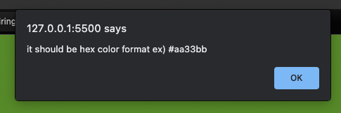

# Change background color 

Nothing crazy, but change background color as the user input. It has to be the _hash tag_ followed by 6 characters that are hex color format.

For this problem, I used the `match()` method in the input to compare the input with the regex.

Ex) when it is a valid input.

Ex) when it is not valid.

