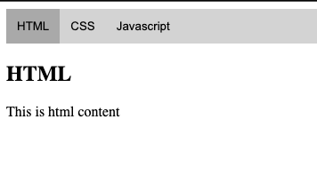

# Tabs

As I was trying to make tabs, I realized (honestly already knew) that I need to spend a lot more time on plain HTML/Javascript like how to architect a better html structure and how to use elements in JS.

I did it again on practice.js just for javascript part. It all made sense as I did it this time. It's like 1. remove all related classNames(thru a loop) then add one on the target element. That's pretty much it.

Result:

