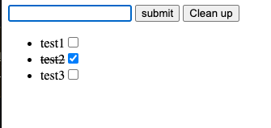

# No base? no job 😂
## Don't be surprised or disappointed when you fail an interview if you don't have fundamentals.

I was very excited when I thought I was doing ok after I passed the first round of an interview process. I was so focused on React type of questions for the second round, but it was all about plain Javascript. It sounded quite simple - _To Do List._ 

No styling required and even googling was allowed. I was so confident about it. However, during the interview, I was shocked that I had no base and I was not familiar with `DOM`. For example, how to create an `element`, when to create or how to use `textNode`

So, I did it again on my own. It's a simple TODO list app w/o any styling. It can simply add a `li` into `ul` with a `checkbox`. When it's checked, it strikes through its list. When the cleanup button is clicked, it removes all the lists. That's it. 

I'll practice other things in this repo. I hope it helps me build concrete fundamentals. 🚀